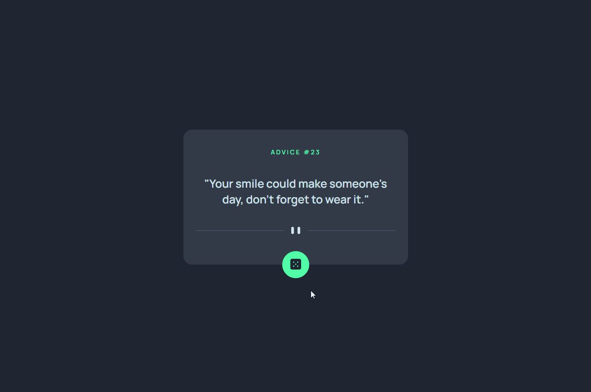

# Advice Generator App 🎲

## 📌 Table of Contents 

- [Overview](#-overview)
- [The Challenge](#-the-challenge)
- [Technologies Used](#-technologies-used)
- [What I Learned](#-what-i-learned)
- [Key Takeaways](#-key-takeaways)
- [Useful Links](#-useful-links)
- [Contributing](#-contributing)
- [Contact](#-contact)

## 🌐 Overview

This project is a solution to the [Advice generator app challenge on Frontend Mentor](https://www.frontendmentor.io/challenges/advice-generator-app-QdUG-13db). The goal was to create an app that allows users to view the optimal layout for the app depending on their device's screen size and generate a new piece of advice by clicking the dice icon.

## 🎯 The Challenge

The challenge included the following tasks:

- Designing the app layout to be responsive across different screen sizes.
- Implementing hover states for interactive elements to enhance user feedback.
- Creating functionality to generate a new piece of advice when clicking the dice icon.

## 💻 Technologies Used

- [HTML5](https://developer.mozilla.org/en-US/docs/Web/HTML)
- [CSS3](https://developer.mozilla.org/en-US/docs/Web/CSS)
- [JavaScript](https://developer.mozilla.org/en-US/docs/Web/JavaScript)
- [Fetch API](https://developer.mozilla.org/en-US/docs/Web/API/Fetch_API)
- [Advice Slip API](https://api.adviceslip.com/)

## 🌱 What I Learned

One of the key learnings from this project was integrating the Fetch API to dynamically fetch advice from the [Advice Slip API](https://api.adviceslip.com/). This allowed for real-time advice updates upon clicking the dice icon.

## 🚀 Key Takeaways

- Understanding the importance of responsive design for optimal user experience.
- Implementing interactive elements with JavaScript to enhance user engagement.
- Utilizing the Fetch API to dynamically fetch and display real-time data.

## 🔗 Useful Links

- [Solution URL](https://github.com/Cauebf/advice-generator-app.git)
- [Live Demo](https://cauebf.github.io/advice-generator-app/)

## 🤝 Contributing

Contributions are welcome! Open issues or pull requests for improvements.

## 💬 Contact 

For any inquiries or collaboration opportunities, reach out via:

(<a href="#advice-generator-app-">back to top</a>)
